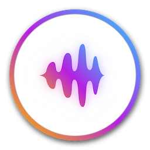

# NoiseBuddy

Change noise cancelling settings on your AirPods Pro or Beats Solo Pro directly from your Mac's Menu Bar or Touch Bar.

I wanted an easier way to change the listening mode settings on AirPods Pro and Beats Solo Pro on the Mac, without having to open the volume menu, so I made this simple app that shows a button in both the Menu Bar and Touch Bar that lets you toggle between the ANC and Transparency modes with a single click. When your Mac is not using a device that supports listening modes, the button will not show up.

You can customize where the button will appear by launching the app and changing the options in its settings screen.

## Installing

**Requires macOS Catalina**.

Download the [latest release](https://github.com/insidegui/NoiseBuddy/releases) or build from source.

_AirPods, Touch Bar and Beats Solo Pro are trademarks of Apple Inc., registered in the U.S. and other countries. This app is not made by, affiliated with or endorsed by Apple._

